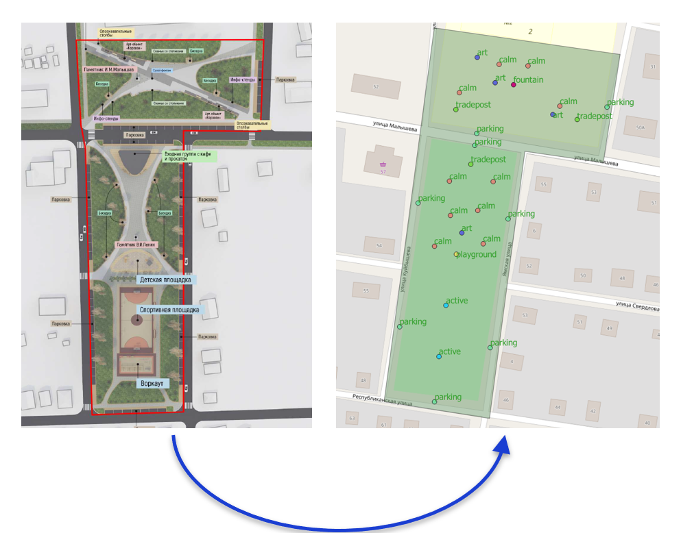
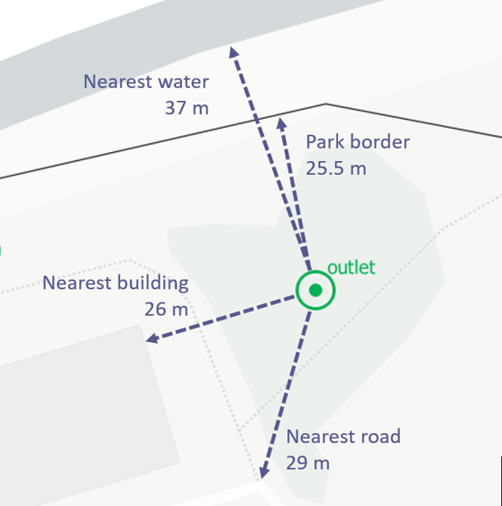
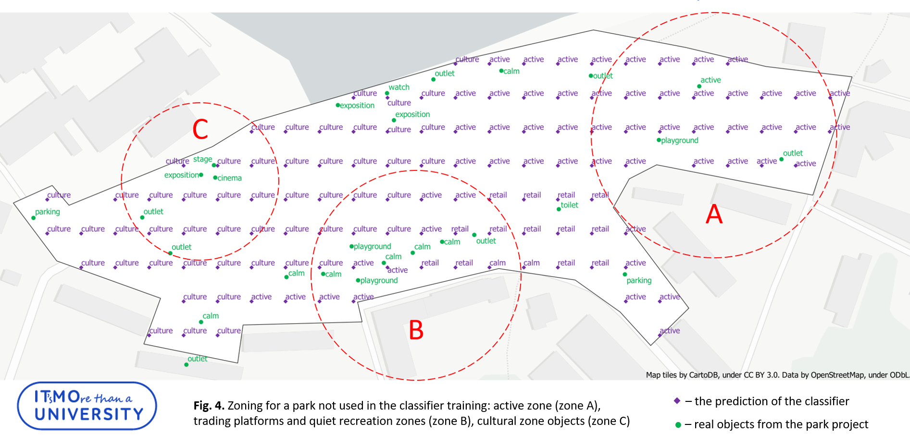

# park-zoning-ml-dataset
Dataset used in "Using Machine Learning Methods in City Park Design Automation" paper for CUPUM 2021 conference.

This research shows that it is possible to extract park design patterns from existing park projects and to use them together with ML to generate zoning plans for new parks

## Research Idea

Research idea is:

1. Extract up park boundaries and objects from project presentations, save to GeoJSON
2. Extract park surroundings data from OpenStreetMap, save to GeoJSON
3. Create a square grid over the park, for each node calculate a set of distances to nearby streets, buildings and other important objects. Save to XLSX
4. Assign zone to each grid node based on extracted park objects
5. Train a classifier (we selected KNN with k=7 as the best one)
6. Now you can give this classifier new park boundaries and surroundings, and it will suggest you park zoning

Extracting park objects:

Calculating features:

Result with predicted grid nodes (purple) and actual park objects (green):

Classifier guessed zonging almost perfectly, e.g. it predicts 'culture' zone in location C, where real architect really put 'exposition' and 'cinema' objects

## Dataset Contents

Dataset contains a set of vector data (boundaries and objects) for 30+ Russian park projects, winners of 2020 national contest "Forming comfortable urban environment", together with extra data used in the research

It contains following folders:

* park_sources - contains GeoJSON files with park boundaries and with objects within the park
* osm_surroundings - contains GeoJSON files with surrounding objects (roads, buildings etc) extracted from OpenStreetMap using YourMaps.io service
* grid_features - contains XLSX files with grid nodes, their real type (based on existing park project) and all distance features calculated. We used scikit-learn to train classifier on this dataset
* classifiers - scikit-learn classifiers, KNN and baseline dummy one, trained on data from grid_features directory
* prediction_results - GeoJSON files with zoning predicted by classifier
* images - some images for this ReadMe

If you have any questions about our research, feel free to contact us at evsmirnov@itmo.ru
